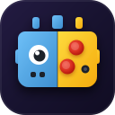

<p align="center">
  
</p>

<h1 align="center">Yandex Games SDK for Godot 4</h1>

<p align="center">
  <b>Universal, Modular, and High-Performance Yandex Games SDK Plugin for Godot Engine</b><br>
  Engineered for Godot 4.3+ with first-class support for <b>GDScript 2.0</b> and <b>C# (.NET 8)</b>
</p>

<p align="center">
  <a href="https://store.godotengine.org/asset/ineedmypills/yandex-games-sdk-for-godot-4/"></a>
  <a href="https://godotengine.org/"></a>
  <a href="https://dotnet.microsoft.com/"></a>
  <a href="https://yandex.ru/dev/games/doc/ru/"></a>
  <a href="LICENSE"></a>
</p>

---

## Table of Contents

- [Overview](#overview)
- [Architecture & Dual Runtime](#architecture--dual-runtime)
- [Installation](#installation)
- [Quick Start](#quick-start)
- [API Reference](#api-reference)
  - [Lifecycle & Core](#lifecycle--core)
  - [Advertisements](#advertisements)
  - [Player & Authentication](#player--authentication)
  - [Cloud Saves & Numeric Stats](#cloud-saves--numeric-stats)
  - [Leaderboards](#leaderboards)
  - [Payments & In-App Purchases](#payments--in-app-purchases)
  - [Feedback & Reviews](#feedback--reviews)
  - [Desktop & Home Screen Shortcuts](#desktop--home-screen-shortcuts)
  - [Asynchronous Multiplayer Sessions](#asynchronous-multiplayer-sessions)
  - [Remote Configuration & Flags](#remote-configuration--flags)
  - [Device & Screen](#device--screen)
  - [Environment & Locale](#environment--locale)
  - [Cross-Promotion](#cross-promotion)
  - [Safe Storage & Clipboard](#safe-storage--clipboard)
  - [Audio Management & Pause Handling](#audio-management--pause-handling)
- [C# (.NET) Usage](#c-net-usage)
- [Web Export & Yandex Console Checklist](#web-export--yandex-console-checklist)
- [Editor Mock Mode](#editor-mock-mode)
- [License](#license)

---

## Overview

This plugin provides zero-overhead, plug-and-play integration with the Yandex Games platform for Godot 4.3+.

### Highlights
- **Native Browser Bridge**: Uses Godot 4's `JavaScriptBridge` for direct, high-performance browser communication.
- **Full Offline Mock Mode**: Runs seamlessly in the Godot Editor (F5) on Windows, macOS, and Linux with local disk persistence (`user://yandex_mock_data.json`) and simulated ad delays.
- **Audio Protection**: Automatically mutes the master audio bus during advertisements and browser tab defocus (`game_api_pause` / `game_api_resume`), fulfilling platform moderation requirements.
- **Ready-to-Use Web Template**: Includes an optimized HTML5 export shell with responsive scaling, focus preservation, loading indicator, and disabled context menus.

---

## Architecture & Dual Runtime

The plugin uses a unified API layer that automatically delegates calls based on the runtime environment:

```
+-------------------------------------------------------------------+
|                        Godot Game Project                         |
|           GDScript (YandexGames.*)  /  C# (YandexGames.*)         |
+-------------------------------------------------------------------+
                                  |
                                  v
+-------------------------------------------------------------------+
|               YandexGames Coordinator (Autoload)                  |
+-------------------------------------------------------------------+
           |                                             |
     (Web Export)                                 (Editor / Desktop)
           |                                             |
           v                                             v
+-----------------------+                    +----------------------+
|   JavaScriptBridge    |                    |   YandexMockBridge   |
| (yandex_bridge.js)    |                    | (Local disk save in  |
|          |            |                    |  user:// and delays) |
|          v            |                    +----------------------+
|    YaGames SDK        |
+-----------------------+
```

---

## Installation

### Method 1: Godot Asset Library
Install directly from the **[Godot Asset Library](https://store.godotengine.org/asset/ineedmypills/yandex-games-sdk-for-godot-4/)** or via the editor:
1. Open your project in Godot 4.
2. Navigate to the **AssetLib** tab at the top.
3. Search for **Yandex Games SDK** (or view it on the [Godot Asset Store](https://store.godotengine.org/asset/ineedmypills/yandex-games-sdk-for-godot-4/)).
4. Click **Download** and **Install**.
5. Go to **Project -> Project Settings -> Plugins** and enable **Yandex Games SDK**.

### Method 2: Manual Installation
1. Clone or download this repository.
2. Copy the `addons/yandex_games` folder into your project's `addons/` directory.
3. Go to **Project -> Project Settings -> Plugins** and enable **Yandex Games SDK**.
4. The singleton `YandexGames` will be automatically registered in your Autoload settings.

---

## Quick Start

```gdscript
extends Node

func _ready() -> void:
    # 1. Notify platform that assets are loaded (Required for catalog)
    YandexGames.game_ready()

    # 2. Show an Interstitial Ad
    var ad_result = await YandexGames.show_interstitial()
    if ad_result.was_shown:
        print("Ad completed successfully")

    # 3. Load Cloud Save
    var save_data = await YandexGames.player.get_data()
    print("Player coins:", save_data.get("coins", 0))
```

---

## API Reference

### Lifecycle & Core

The core singleton coordinates platform events and lifecycle states.

```gdscript
# Notify platform that the game is ready (calls LoadingAPI.ready())
YandexGames.game_ready()

# Mark active gameplay start (level start, unpause)
YandexGames.gameplay_start()

# Mark gameplay stop (game over, pause menu)
YandexGames.gameplay_stop()

# Synchronized server timestamp in milliseconds (UTC)
var server_time_ms: int = YandexGames.get_server_time()

# Check if a specific SDK method is supported in the current environment
var has_feature: bool = await YandexGames.is_available_method("leaderboards.setScore")
```

---

### Advertisements

Submodule: `YandexGames.ads` (or top-level shortcuts on `YandexGames`).

#### Methods

```gdscript
# Fullscreen Interstitial Ad
# Returns: { "success": bool, "was_shown": bool, "error": String }
var res: Dictionary = await YandexGames.show_interstitial()

# Rewarded Video Ad
# Returns: { "success": bool, "rewarded": bool, "was_shown": bool, "error": String }
var res: Dictionary = await YandexGames.show_rewarded()
if res.rewarded:
    give_player_reward()

# Sticky Banner
await YandexGames.ads.show_banner()
await YandexGames.ads.hide_banner()
var banner_status = await YandexGames.ads.get_banner_status()
# Returns: { "is_showing": bool, "reason": String }
```

#### Signals

- `YandexGames.ads.interstitial_opened`
- `YandexGames.ads.interstitial_closed(was_shown: bool)`
- `YandexGames.ads.interstitial_failed(error: String)`
- `YandexGames.ads.interstitial_offline`
- `YandexGames.ads.rewarded_opened`
- `YandexGames.ads.rewarded_rewarded`
- `YandexGames.ads.rewarded_closed(was_shown: bool)`
- `YandexGames.ads.rewarded_failed(error: String)`
- `YandexGames.ads.banner_shown`
- `YandexGames.ads.banner_hidden`
- `YandexGames.ads.banner_status_changed(is_showing: bool, reason: String)`

---

### Player & Authentication

Submodule: `YandexGames.player`.

```gdscript
# Open native Yandex ID login dialog
var info: Dictionary = await YandexGames.player.open_auth_dialog()

# Status and Profile Data
var is_auth: bool = YandexGames.player.is_authorized()
var user_id: String = YandexGames.player.get_id()
var user_name: String = YandexGames.player.get_name()
var avatar_url: String = YandexGames.player.get_photo("medium") # "small", "medium", "large"
var paying_status: String = YandexGames.player.get_paying_status() # "paying" or ""
var signature: String = YandexGames.player.get_signature() # Cryptographic signature for backend validation

# IDs across other games by developer
var cross_ids: Array = await YandexGames.player.get_ids_per_game()
```

---

### Cloud Saves & Numeric Stats

Submodule: `YandexGames.player`.

```gdscript
# Save data to Cloud (flush = true forces immediate sync)
await YandexGames.player.set_data({
    "coins": 500,
    "level": 3,
    "equipped_skin": "dragon"
}, true)

# Load data from Cloud (pass array of keys or null for all)
var save_data: Dictionary = await YandexGames.player.get_data(["coins", "level"])

# Numeric Statistics
await YandexGames.player.set_stats({ "high_score": 12000 })
var stats: Dictionary = await YandexGames.player.get_stats(["high_score"])

# Atomic cloud increment (safe against race conditions)
var updated_stats = await YandexGames.player.increment_stats({ "enemies_defeated": 10 })
```

---

### Leaderboards

Submodule: `YandexGames.leaderboards`.

```gdscript
# Submit player score (optional extra_data up to 1024 chars)
await YandexGames.leaderboards.set_score("highscores", 2500, "character_mage")

# Get current player's entry and rank
var player_entry: Dictionary = await YandexGames.leaderboards.get_player_entry("highscores")
print("Rank: ", player_entry.get("rank"), " Score: ", player_entry.get("score"))

# Fetch top entries
var leaderboard: Dictionary = await YandexGames.leaderboards.get_entries("highscores", {
    "quantityTop": 10,
    "includeUser": true,
    "quantityAround": 3
})

for entry in leaderboard.get("entries", []):
    print("#%d %s - %d" % [entry.rank, entry.player.publicName, entry.score])

# Get Leaderboard Description
var desc: Dictionary = await YandexGames.leaderboards.get_description("highscores")
```

---

### Payments & In-App Purchases

Submodule: `YandexGames.payments`.

```gdscript
# Fetch Product Catalog
var catalog: Array = await YandexGames.payments.get_catalog()
for item in catalog:
    print(item.id, ": ", item.title, " - ", item.price)

# Purchase Item
var purchase: Dictionary = await YandexGames.payments.purchase("coins_pack_100", "payload_123")
if not purchase.is_empty():
    give_purchased_item()
    
    # Consume consumable item
    var token = purchase.get("purchaseToken", "")
    await YandexGames.payments.consume_purchase(token)

# Retrieve active purchases (unconsumed or permanent)
var purchases: Array = await YandexGames.payments.get_purchases()
```

---

### Feedback & Reviews

Submodule: `YandexGames.feedback`.

```gdscript
# Check eligibility
var status: Dictionary = await YandexGames.feedback.can_review()
if status.get("value", false):
    # Open review dialog
    var result: Dictionary = await YandexGames.feedback.request_review()
    print("Feedback sent: ", result.get("feedback_sent", false))
else:
    print("Cannot review: ", status.get("reason", "UNKNOWN"))
```

---

### Desktop & Home Screen Shortcuts

Submodule: `YandexGames.shortcut`.

```gdscript
# Check availability
if await YandexGames.shortcut.can_show_prompt():
    var res = await YandexGames.shortcut.show_prompt()
    print("Prompt outcome: ", res.get("outcome")) # "accepted" or "rejected"
```

---

### Asynchronous Multiplayer Sessions

Submodule: `YandexGames.multiplayer_sessions`.

Record player timeline transactions and play against ghost opponents without maintaining custom backend servers.

```gdscript
# 1. Initialize sessions and fetch opponents
var opponents: Array[Dictionary] = await YandexGames.multiplayer_sessions.init_sessions({
    "count": 2,
    "isEventBased": true,
    "maxOpponentTurnTime": 3000,
    "meta": {
        "meta1": { "min": 0, "max": 5000 }
    }
})

# 2. Commit player actions during gameplay
YandexGames.multiplayer_sessions.commit({ "action": "jump", "x": 12.4, "y": 4.0 })

# 3. Publish session on match finish
await YandexGames.multiplayer_sessions.push({ "meta1": final_score })

# Signals for event-based playback:
YandexGames.multiplayer_sessions.transaction_received.connect(func(opponent_id: String, transactions: Array[Dictionary]) -> void:
    apply_opponent_actions(opponent_id, transactions)
)
YandexGames.multiplayer_sessions.session_finished.connect(func(opponent_id: String) -> void:
    on_opponent_finish(opponent_id)
)
```

---

### Remote Configuration & Flags

Submodule: `YandexGames.remote_config`.

```gdscript
# Fetch flags with optional client features and default fallbacks
var flags: Dictionary = await YandexGames.remote_config.get_flags(
    [{ "name": "cohort", "value": "beta" }],
    { "difficulty": "normal", "promo_active": "false", "starting_coins": "100" }
)

var difficulty: String = YandexGames.remote_config.get_flag_string("difficulty", "normal")
var promo_on: bool = YandexGames.remote_config.get_flag_bool("promo_active", false)
var coins: int = YandexGames.remote_config.get_flag_int("starting_coins", 100)
```

---

### Device & Screen

Submodule: `YandexGames.device`.

```gdscript
# Device Type
var device_type: String = YandexGames.device.get_type() # "desktop", "mobile", "tablet", "tv"
var is_mob: bool = YandexGames.device.is_mobile()
var is_tv: bool = YandexGames.device.is_tv()

# Browser Fullscreen
var is_fs: bool = YandexGames.device.is_fullscreen()
await YandexGames.device.request_fullscreen()
await YandexGames.device.exit_fullscreen()
```

---

### Environment & Locale

Submodule: `YandexGames.environment`.

```gdscript
var app_id: String = YandexGames.environment.get_app_id()
var lang: String = YandexGames.environment.get_lang() # "ru", "en", "tr", etc.
var browser_lang: String = YandexGames.environment.get_browser_lang()
var tld: String = YandexGames.environment.get_tld() # "ru", "com", "by", "kz", etc.
var payload: String = YandexGames.environment.get_payload() # URL query parameters
```

---

### Cross-Promotion

Submodule: `YandexGames.games`.

```gdscript
# Fetch other games published by the same developer
var games_list: Array = await YandexGames.games.get_all_games()

# Get details of a specific game
var game_info: Dictionary = await YandexGames.games.get_game_by_id("123456")
```

---

### Safe Storage & Clipboard

```gdscript
# Safe LocalStorage (handles Safari Private Browsing quota restrictions)
await YandexGames.storage.set_item("user_settings", "{ \"sound\": true }")
var settings_json: String = await YandexGames.storage.get_item("user_settings")

# System Clipboard
await YandexGames.clipboard.write_text("https://yandex.ru/games/app/...")
```

---

### Audio Management & Pause Handling

The plugin automatically listens to `game_api_pause` and `game_api_resume` platform events (triggered on tab switch, window minimize, or system dialogs).

- `auto_mute_audio = true` (Default): Automatically mutes `AudioServer` master bus on pause and ad display, then un-mutes on resume.
- Signals:
  - `YandexGames.game_paused`
  - `YandexGames.game_resumed`

---

## C# (.NET) Usage

All functions are available as type-safe asynchronous tasks (`Task<T>`) under the `YandexGamesSDK` namespace:

```csharp
using Godot;
using System.Threading.Tasks;
using YandexGamesSDK;

public partial class GameManager : Node
{
    public override async void _Ready()
    {
        // 1. Ready Notification
        YandexGames.GameReady();

        // 2. Interstitial Ad
        var adResult = await YandexGames.Ads.ShowInterstitialAsync();

        // 3. Rewarded Ad
        var rewardResult = await YandexGames.Ads.ShowRewardedAsync();
        if (rewardResult.ContainsKey("rewarded") && (bool)rewardResult["rewarded"])
        {
            GD.Print("Reward granted!");
        }

        // 4. Cloud Save
        var data = new Godot.Collections.Dictionary { { "level", 10 } };
        await YandexGames.Player.SetDataAsync(data, true);

        // 5. Leaderboards
        await YandexGames.Leaderboards.SetScoreAsync("highscores", 5000);
    }
}
```

---

## Web Export & Yandex Console Checklist

### 1. Godot Export Preset

When you enable the plugin, a **"Web (Yandex Games)"** export preset is created automatically in `export_presets.cfg` — including the correct **Custom HTML Shell** pointing to `yandex_template.html`. Nothing to configure manually.

**If you already had a Web preset before installing this plugin**, open **Project → Export**, select your preset, and set **Options → Custom HTML Shell** to:
```
res://addons/yandex_games/templates/yandex_template.html
```
The export window will show a warning banner until this is set correctly.

Once the preset is ready:
1. Set **Export Type** to `Regular` (or `Threads` if your project requires multithreading).
2. Click **Export Project** and save the `.zip` archive.

### 2. Yandex Developer Console Requirements
- [x] `YandexGames.game_ready()` called after initial assets are loaded.
- [x] Gameplay events marked via `YandexGames.gameplay_start()` / `gameplay_stop()`.
- [x] Game pauses audio and logic during platform pause events (handled automatically by this addon).
- [x] In-app purchases correctly consumed via `YandexGames.payments.consume_purchase()`.

---

## Editor Mock Mode

When testing within the Godot Editor (F5) or running desktop builds, the plugin switches to `YandexMockBridge`:

- **Disk Persistence**: Player saves, stats, and purchases persist across runs in `user://yandex_mock_data.json`.
- **Simulated Delays**: Ad watching and network queries emulate realistic network latency.
- **Interactive Testing**: Open `addons/yandex_games/examples/demo.tscn` to test every feature via a ready-made UI dashboard.

---

## License

This project is licensed under the [MIT License](LICENSE).
